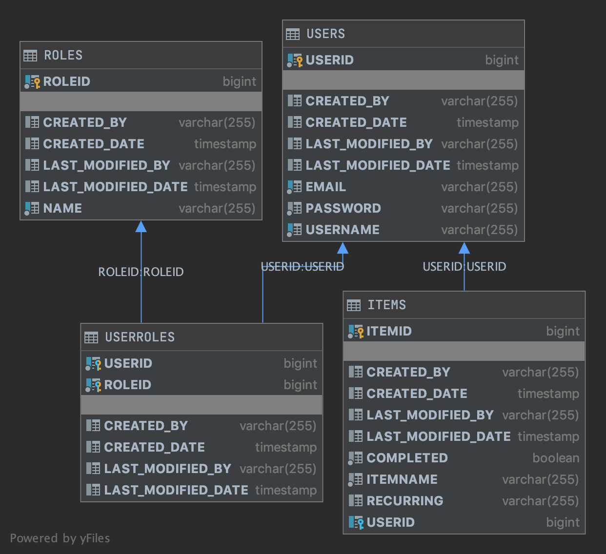

# WunderList - Java Backend

### Documentation v1
Below is an overall view of the database tables. Note that ROLES and USERROLES are explicity used for authorization and should be ignored by the front end.

### Endpoints & Model Information

You can test endpoints straight from your browser by using the interactive app
[Here](https://wlist-java.herokuapp.com/swagger-ui.html)

